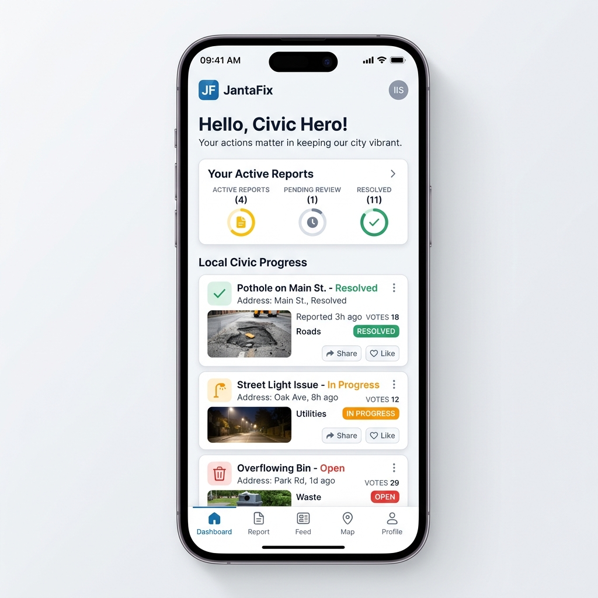
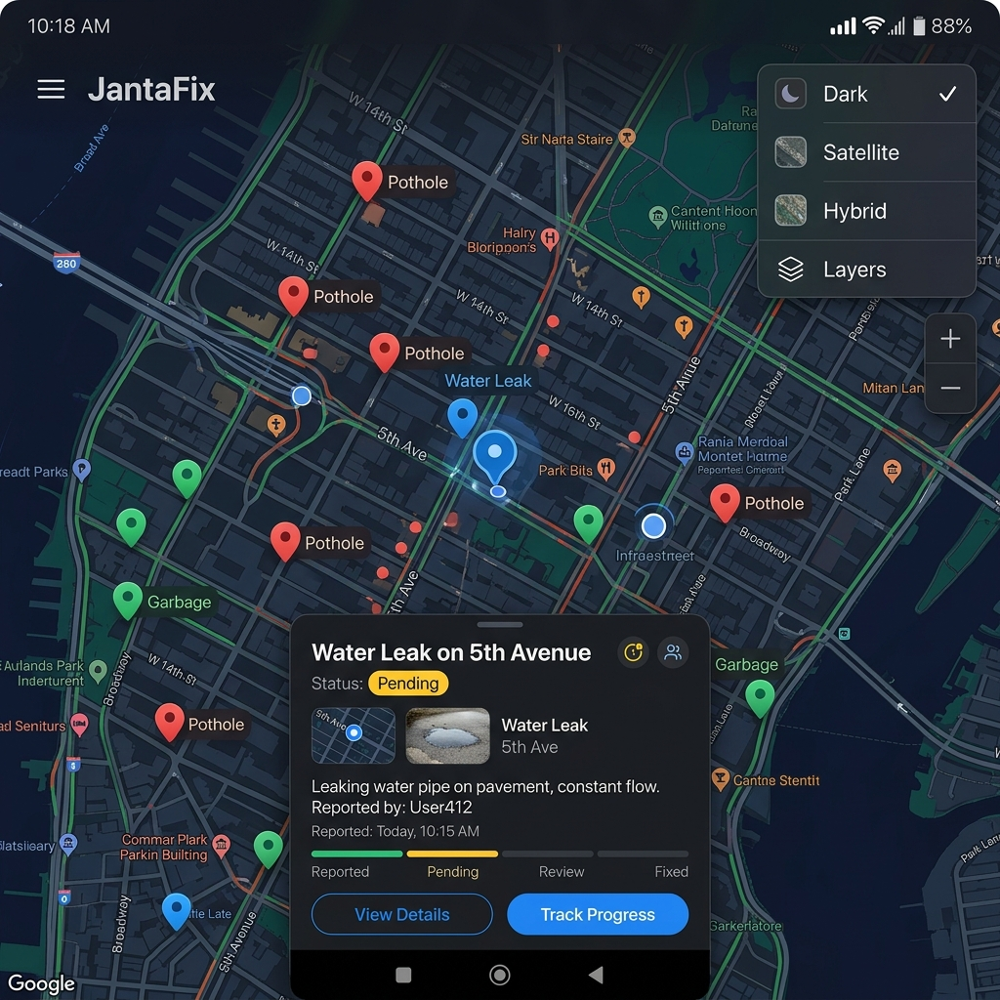
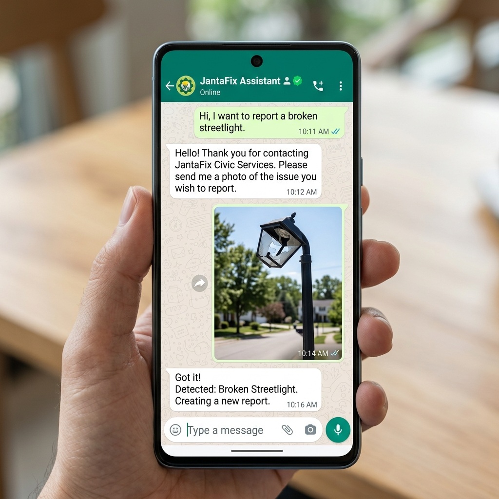
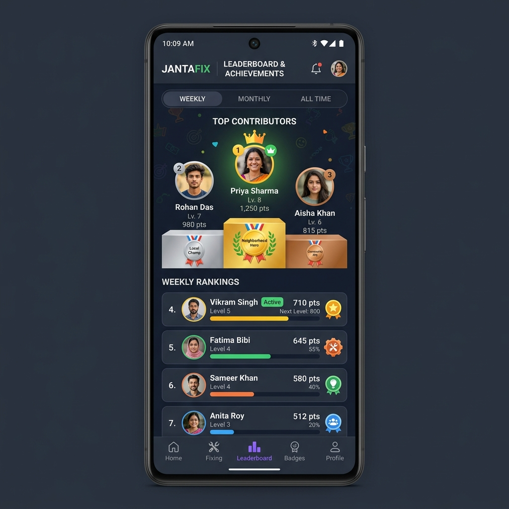
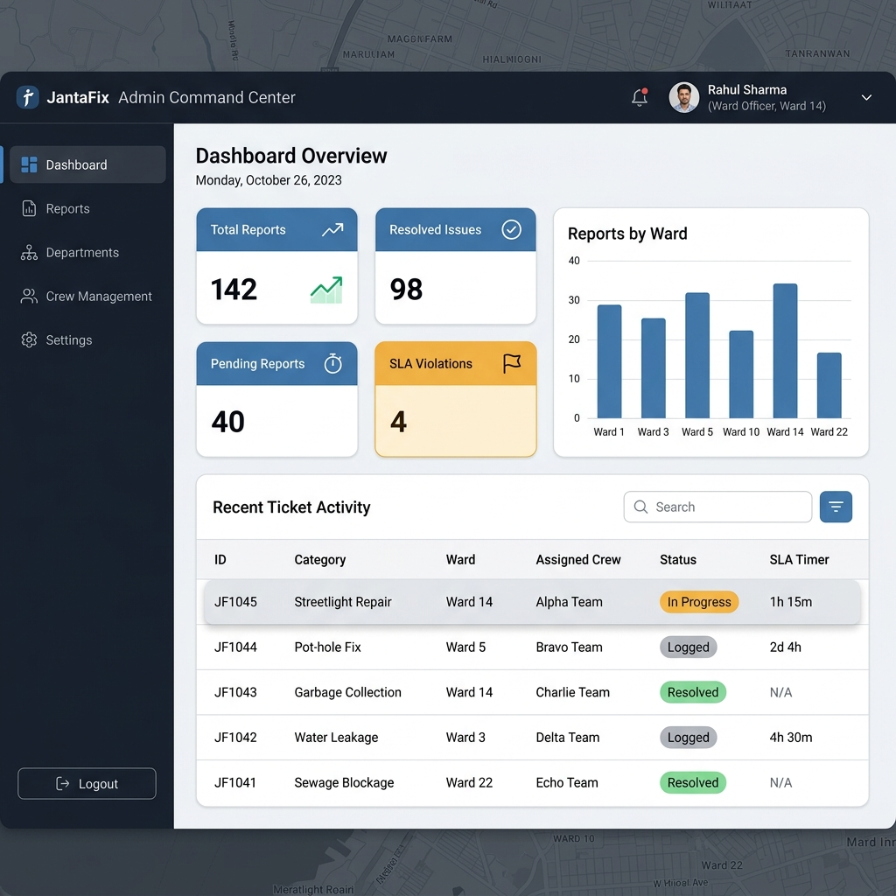
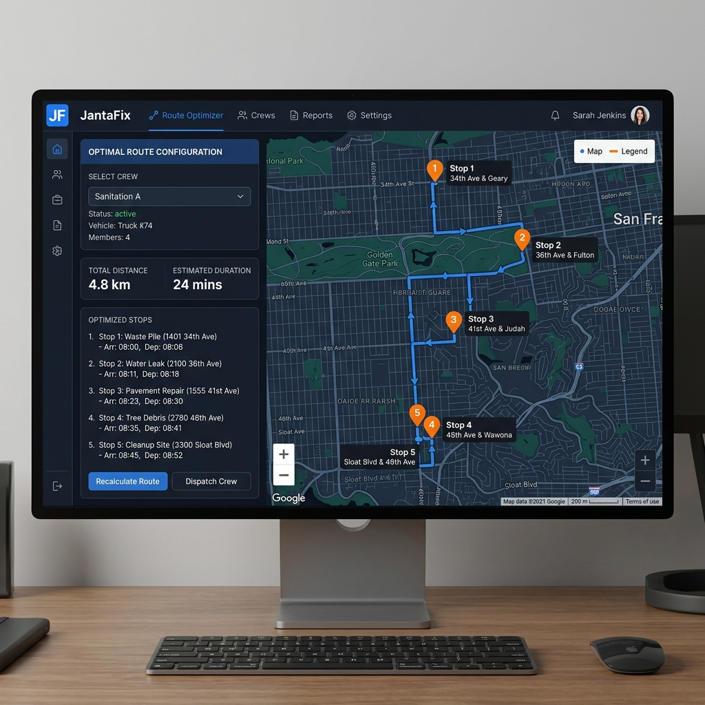

# 🌟 JantaFix - Hyperlocal Civic Problem Solver

[](https://blockseblock.com)
[](https://cloud.google.com)
[](https://vitejs.dev)
[](https://typescriptlang.org)

**JantaFix** is a modern, mobile-first, AI-driven hyperlocal civic issue reporting and resolution platform. It bridges the gap between active citizens and municipal ward officers, transforming passive residents into "Civic Heroes." Through interactive mapping, gamified reward loops, WhatsApp automated reporting channels, and dynamic admin routing, it streamlines public infrastructure repair (potholes, water leaks, broken streetlights, waste piles) to keep communities safe and beautiful.

---

## 📸 Application Screenshots

> 💡 **Tip for Participant:** To make your hackathon submission look stunning on GitHub and in your Google Doc, run the application locally or view the preview, take screenshots of the screens described below, and save them in the `assets/screenshots/` folder with the specified filenames!

| 📱 Citizen Landing Dashboard | 🗺️ Live Interactive Map View |
| :---: | :---: |
|  <br> *Clean, light-themed responsive feed showing local civic progress and reports* |  <br> *Leaflet maps with layer toggles (Dark, Satellite, Hybrid) and live custom markers* |

| 💬 WhatsApp Automated Assistant | 🏆 Leaderboard & Gamification |
| :---: | :---: |
|  <br> *Conversational AI flow simulated to report public issues via chat* |  <br> *Top active neighborhood contributors ranked with badges and civic score progression* |

| 🏢 Restricted Admin Command Center | 📍 Intelligent Crew Route Optimizer |
| :---: | :---: |
|  <br> *Restricted dashboard for Department Heads and Ward Officers based on role mapping* |  <br> *Intelligent shortest-path generator for municipal maintenance field crews* |

---

## ✨ Core Features & Unique Innovation

### 1. Interactive Live Mapping & Custom Basemaps
* **Leaflet & OpenStreetMap Integration:** Displays pinned categories with high-contrast, color-coded icons (Red for Potholes, Blue for Water Leaks, Yellow for Streetlights, Green for Garbage).
* **Multi-Layer Switching:** Toggle map views between *Dark Mode, Streets, Satellite, Terrain, and Hybrid* instantly.
* **Smart Geolocation:** High-accuracy HTML5 Location API tracking with native permission handling.

### 2. Intelligent Reporting & Deduplication Engine
* **Gemini-Powered AI Assistant:** Automatically categorizes reports, analyzes images, rates severity level ($1-10$), and assigns municipal responsibilities server-side.
* **Proximity Safeguard (Deduplication):** Alerts users if another citizen has already reported a similar issue within $50$ meters and prompts them to **upvote** it instead, saving municipal database resources.
* **WhatsApp Interactive Flow:** A beautiful, responsive visual mockup showing how citizens can report issues naturally in standard messaging channels.

### 3. Deep Gamification & Civic Reputation Loops
* **Dynamic Scoring System:** Citizens earn $+10$ Civic Points for logging verified issues, $+5$ for upvoting existing issues, and $+20$ for volunteering in community cleanups.
* **Progression Ranks:** Citizens level up from $1$ to $10$, unlocking custom vector badges like *Neighborhood Hero*, *Super Reporter*, and *SLA Enforcer*.
* **Real-time Leaderboards:** Displays local citizen rankings in a gorgeous visual card podium to build civic pride.

### 4. Restricted Admin Command Center
* **Role-Based Access Control:** Simulates specialized logins for **Ward Officers** (restricted to assigned wards) and **Department Heads** (restricted to assigned utilities like Roads, Sanitation).
* **SLA Resolution Lifecycle:** Tickets advance through *Logged ➔ In Progress ➔ Resolved ➔ Citizen Verified* states with real-time timers.
* **Intelligent Route Optimizer:** Generates the most efficient physical path on the map for field maintenance crews to visit selected outstanding locations, reducing fuel and response times.

---

## 🛠️ Architecture & Tech Stack

```
┌─────────────────────────────────────────────────────────────┐
│                       CLIENT SIDE                           │
│  ┌──────────────────┐ ┌──────────────────┐ ┌─────────────┐  │
│  │    React (v18)   │ │  Tailwind CSS v4 │ │   Leaflet   │  │
│  └────────┬─────────┘ └────────┬─────────┘ └──────┬──────┘  │
└───────────┼────────────────────┼──────────────────┼─────────┘
            │                    │                  │
            ▼                    ▼                  ▼
┌─────────────────────────────────────────────────────────────┐
│                       SERVER SIDE                           │
│  ┌───────────────────────────────────────────────────────┐  │
│  │                 Express Node.js Server                │  │
│  └──────────────────────────┬────────────────────────────┘  │
│                             ▼                               │
│  ┌───────────────────────────────────────────────────────┐  │
│  │             Google Gemini API (Generative AI)         │  │
│  └───────────────────────────────────────────────────────┘  │
└─────────────────────────────────────────────────────────────┘
```

* **Frontend:** React 18 (Vite, TypeScript, Tailwind CSS, Lucide Icons, Framer Motion)
* **Maps:** Leaflet JS & React-Leaflet
* **Backend:** Express API proxy layer
* **AI Core:** `@google/genai` Node.js SDK (integrating server-side for API key privacy)

---

## 🚀 Local Installation & Running Guide

To run this project on your local machine, follow these steps:

### 📋 Prerequisites
* **Node.js** (v18 or higher recommended)
* **npm** (v9 or higher)

### ⚙️ Step-by-Step Setup

1. **Download & Extract ZIP:**
   Download the project's source files from Google AI Studio and extract them to your local directory.

2. **Install Dependencies:**
   Navigate into the project root directory and run:
   ```bash
   npm install
   ```

3. **Configure Environment Variables:**
   Create a `.env` file in the root directory and add your Google Gemini API key:
   ```env
   GEMINI_API_KEY=your_gemini_api_key_here
   ```

4. **Launch Development Server:**
   ```bash
   npm run dev
   ```
   The local server will boot, and you can open the interactive preview at:
   👉 **`http://localhost:3000`**

5. **Build for Production:**
   To bundle and compile the server and frontend for production deployment:
   ```bash
   npm run build
   ```

---

## 🏆 Hackathon Evaluation Alignment

This platform is custom-built to hit top scores in every criterion of the **Vibe2Ship Evaluation Matrix**:

* **Problem Solving & Impact (20%):** Direct digital bridges between citizens and municipal officers, replacing slow offline forms.
* **Agentic Depth & AI Capabilities (20%):** Deploys Google Gemini for automated report ingestion, severity routing, and simulated WhatsApp chat logic.
* **Innovation & Creativity (20%):** Solves the "ticket duplicate" issue through location-based deduplication algorithms and gamified upvoting incentives.
* **Usage of Google Technologies (15%):** Pure server-side integration of Google Gemini API and cloud container-ready builds.
* **Product Experience & Design (10%):** High-fidelity responsive mobile design, customizable map tiles, and eye-friendly dark/light theme options.
* **Completeness & Usability (5%):** Clean source organization, standard CJS compilation scripts, fully persistent local and mock states.
